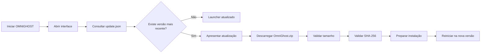

<p align="center">
  
</p>

<div align="center">

[](https://github.com/rodrigomatossilva07-rgb/OmniGhost-Updates/releases/latest)
[](#-requisitos)
[](https://github.com/rodrigomatossilva07-rgb/OmniGhost-Updates/releases/latest)
[](#-sistema-de-atualização)

<br>

### Biblioteca, integrações e atualizações num único launcher.

O **OMNIGHOST** proporciona uma experiência centralizada para gerir jogos, acompanhar alterações reais do projeto e receber novas versões através de um sistema de atualização integrado.

<br>

[](https://github.com/rodrigomatossilva07-rgb/OmniGhost-Updates/releases/latest)
[](https://github.com/rodrigomatossilva07-rgb/OmniGhost-Updates/releases)

</div>

---

## ✦ Índice

- [Sobre o OMNIGHOST](#-sobre-o-omnighost)
- [Destaques](#-destaques)
- [Experiência do launcher](#-experiência-do-launcher)
- [Instalação](#-instalação)
- [Sistema de atualização](#-sistema-de-atualização)
- [Página Atualizações](#-página-atualizações)
- [Estrutura das releases](#-estrutura-das-releases)
- [Integridade e segurança](#-integridade-e-segurança)
- [Requisitos](#-requisitos)
- [Resolução de problemas](#-resolução-de-problemas)
- [Suporte](#-suporte)
- [Estado do projeto](#-estado-do-projeto)
- [Aviso legal](#-aviso-legal)

---

## ✦ Sobre o OMNIGHOST

O **OMNIGHOST** é um launcher multi-jogo para Windows, desenvolvido com foco em organização, desempenho e consistência visual.

A aplicação reúne num único ambiente:

- biblioteca de jogos;
- módulos e integrações disponíveis;
- lançamento e gestão de jogos;
- histórico real de alterações;
- verificação automática de novas versões;
- instalação segura de atualizações.

Este repositório funciona como o **canal oficial de distribuição pública** do OMNIGHOST.

Aqui são publicadas as versões estáveis, os pacotes executáveis, os manifestos utilizados pelo atualizador e os ficheiros que alimentam a página de atualizações do launcher.

> [!NOTE]
> Este repositório é destinado principalmente à distribuição das versões oficiais do OMNIGHOST.

---

## ✦ Destaques

<table>
<tr>
<td width="50%" valign="top">

### ◈ Biblioteca centralizada

Consulta e organiza os jogos e módulos suportados através de uma única interface.

</td>
<td width="50%" valign="top">

### ◈ Atualizações automáticas

O launcher procura novas versões em segundo plano sem bloquear a abertura da aplicação.

</td>
</tr>

<tr>
<td width="50%" valign="top">

### ◈ Histórico real

A página **Atualizações** utiliza dados publicados e validados, sem alterações fictícias ou textos de demonstração.

</td>
<td width="50%" valign="top">

### ◈ Validação de integridade

Os pacotes descarregados são confirmados através do tamanho esperado e do respetivo hash SHA-256.

</td>
</tr>

<tr>
<td width="50%" valign="top">

### ◈ Funcionamento offline

O cache local permite continuar a consultar os últimos dados válidos quando não existe ligação à Internet.

</td>
<td width="50%" valign="top">

### ◈ Design consistente

Interface escura com detalhes dourados, componentes compactos e navegação criada para uma experiência moderna.

</td>
</tr>
</table>

---

## ✦ Experiência do launcher

O OMNIGHOST foi estruturado para manter as diferentes áreas da aplicação organizadas e independentes.

### Biblioteca

A Biblioteca concentra os jogos e módulos disponíveis, permitindo apresentar:

- estado da instalação;
- localização do jogo;
- disponibilidade do módulo;
- ações de lançamento;
- configurações específicas;
- informação relevante para cada integração.

### Atualizações

A página Atualizações apresenta o histórico das versões publicadas, com suporte para:

- pesquisa por texto;
- filtro por jogo ou componente;
- filtro por categoria;
- ordenação por data;
- identificação de atualizações ainda não visualizadas;
- agrupamento por mês e ano;
- funcionamento com cache local.

### Notícias

A área de Notícias pode ser utilizada para comunicação do projeto, anúncios e outras informações relevantes, mantendo esse conteúdo separado do changelog técnico.

---

## ✦ Instalação

### 1. Abrir a release mais recente

Acede à página oficial:

[**Abrir a última versão do OMNIGHOST**](https://github.com/rodrigomatossilva07-rgb/OmniGhost-Updates/releases/latest)

### 2. Descarregar o pacote correto

Na secção **Assets**, descarrega:

```text
OmniGhost.zip
```

### 3. Extrair o conteúdo

Extrai todos os ficheiros para uma pasta à tua escolha.

Exemplo:

```text
C:\Programas\OmniGhost\
```

### 4. Executar

Abre:

```text
OmniGhost.exe
```

> [!IMPORTANT]
> Não executes o `OmniGhost.exe` diretamente dentro do ficheiro ZIP.  
> Extrai primeiro todo o conteúdo para garantir que os recursos, dados e bibliotecas necessários ficam disponíveis.

> [!WARNING]
> Os ficheiros `Source code (zip)` e `Source code (tar.gz)` são criados automaticamente pelo GitHub. Eles não correspondem ao pacote pronto a executar.

---

## ✦ Sistema de atualização

Sempre que o launcher é iniciado, é efetuada uma verificação automática em segundo plano.

A interface abre imediatamente e não fica bloqueada enquanto o pedido de rede é processado.



### Fluxo de validação

Antes da instalação, o atualizador confirma:

1. origem do manifesto;
2. versão publicada;
3. plataforma e arquitetura;
4. nome do pacote;
5. URL de download;
6. tamanho esperado;
7. hash SHA-256;
8. integridade do ficheiro descarregado.

Caso alguma validação falhe, a instalação é interrompida e a versão atual permanece preservada.

### Atualizações opcionais e obrigatórias

Por padrão, as novas versões podem ser adiadas.

Uma atualização só deve impedir a continuação normal quando o manifesto indicar que a versão instalada deixou de ser suportada.

---

## ✦ Página Atualizações

O changelog do OMNIGHOST é mantido separadamente do manifesto utilizado para atualizar o executável.

```text
update.json
```

Responsável pela atualização da aplicação.

```text
changelog.json
```

Responsável pelo histórico visual apresentado dentro do launcher.

As alterações podem ser organizadas nestas categorias:

| Categoria | Identificação | Utilização |
|:--|:--:|:--|
| **Adicionado** | 🟢 | Novas funcionalidades, integrações ou opções |
| **Melhorado** | 🔵 | Melhorias de utilização, estabilidade ou interface |
| **Corrigido** | 🟠 | Correções de problemas identificados |
| **Desempenho** | 🟡 | Otimizações de velocidade e consumo de recursos |
| **Compatibilidade** | 🟣 | Ajustes relacionados com jogos ou ambientes suportados |
| **Segurança** | 🛡️ | Melhorias de validação, proteção e integridade |
| **Removido** | 🔴 | Funcionalidades retiradas ou descontinuadas |
| **Alteração importante** | ⚠️ | Mudanças que podem exigir atenção do utilizador |

> [!IMPORTANT]
> A página apresenta apenas alterações reais do projeto OMNIGHOST.  
> Atualizações oficiais realizadas por empresas responsáveis pelos jogos não são apresentadas como alterações feitas pelo launcher.

---

## ✦ Estrutura das releases

Cada versão oficial pode incluir quatro ficheiros principais:

| Ficheiro | Finalidade |
|:--|:--|
| **`OmniGhost.zip`** | Pacote completo do launcher pronto a extrair |
| **`update.json`** | Manifesto consultado pelo sistema de atualização |
| **`changelog.json`** | Histórico utilizado pela página Atualizações |
| **`release-notes.md`** | Notas formatadas apresentadas na GitHub Release |

### Exemplo de assets

```text
Assets
├── OmniGhost.zip
├── update.json
├── changelog.json
└── release-notes.md
```

O GitHub também adiciona automaticamente:

```text
Source code (zip)
Source code (tar.gz)
```

Esses dois ficheiros não fazem parte do pacote de instalação preparado pelo projeto.

<details>
<summary><strong>Ver exemplo simplificado do update.json</strong></summary>

```json
{
  "schemaVersion": 1,
  "appId": "com.omnighost.launcher",
  "channel": "stable",
  "version": "1.6.4",
  "minimumSupportedVersion": "1.0.0",
  "mandatory": false,
  "publishedAt": "2026-08-05T14:00:00Z",
  "releaseNotesUrl": "https://github.com/rodrigomatossilva07-rgb/OmniGhost-Updates/releases/tag/v1.6.4",
  "packages": [
    {
      "platform": "windows",
      "architecture": "x64",
      "fileName": "OmniGhost.zip",
      "url": "https://github.com/rodrigomatossilva07-rgb/OmniGhost-Updates/releases/download/v1.6.4/OmniGhost.zip",
      "size": 0,
      "sha256": "HASH_SHA256_DO_PACOTE"
    }
  ]
}
```

> O exemplo demonstra apenas a estrutura do manifesto. Os valores reais são gerados em cada release.

</details>

---

## ✦ Integridade e segurança

O sistema de atualização foi concebido para rejeitar pacotes inesperados ou inconsistentes.

### Verificações aplicadas

- comunicação através de HTTPS;
- origem remota controlada;
- validação da versão do esquema;
- validação de campos obrigatórios;
- confirmação da plataforma Windows;
- confirmação da arquitetura x64;
- limite de tamanho do download;
- comparação do tamanho recebido;
- validação do SHA-256;
- utilização de pasta temporária;
- preservação da versão atual em caso de falha.

### SHA-256

O SHA-256 permite confirmar que o pacote descarregado corresponde exatamente ao ficheiro publicado.

Qualquer alteração no conteúdo do ZIP modifica o hash, fazendo com que o atualizador rejeite o pacote.

```text
Ficheiro publicado
        │
        ▼
Cálculo SHA-256
        │
        ▼
Comparação com update.json
        │
        ├── Correspondente ──► Continuar instalação
        │
        └── Diferente ───────► Cancelar atualização
```

---

## ✦ Requisitos

| Requisito | Valor |
|:--|:--|
| Sistema operativo | Windows 10 ou Windows 11 |
| Arquitetura | 64 bits |
| Ligação à Internet | Necessária para procurar e descarregar atualizações |
| Armazenamento | Espaço suficiente para o programa e ficheiros temporários |
| Permissões | Capacidade para executar a aplicação e escrever na pasta escolhida |

---

## ✦ Resolução de problemas

<details>
<summary><strong>O launcher não abre</strong></summary>

- Confirma que extraíste todos os ficheiros do ZIP.
- Evita executar diretamente a partir da pasta comprimida.
- Tenta mover o programa para uma pasta simples, por exemplo:

```text
C:\OmniGhost\
```

- Confirma que o antivírus não colocou algum ficheiro necessário em quarentena.

</details>

<details>
<summary><strong>Não foi possível verificar atualizações</strong></summary>

- Confirma a ligação à Internet.
- Tenta novamente após alguns segundos.
- Confirma que o GitHub está acessível no navegador.
- Verifica se uma firewall, VPN ou proxy está a bloquear a aplicação.
- A falha da verificação não deve impedir a utilização normal do launcher.

</details>

<details>
<summary><strong>A atualização foi encontrada, mas não foi instalada</strong></summary>

O atualizador pode ter interrompido o processo por:

- tamanho diferente do esperado;
- SHA-256 incorreto;
- download incompleto;
- falta de permissões;
- ficheiro bloqueado por outro processo;
- resposta remota inválida.

Nestes casos, a instalação é cancelada para preservar a versão atual.

</details>

<details>
<summary><strong>Qual ficheiro devo descarregar?</strong></summary>

Descarrega sempre:

```text
OmniGhost.zip
```

Não descarregues os pacotes automáticos de código-fonte como instalação do launcher.

</details>

---

## ✦ Suporte

Ao reportar um problema, inclui sempre que possível:

- versão instalada do OMNIGHOST;
- versão do Windows;
- descrição clara do problema;
- passos necessários para reproduzir;
- resultado esperado;
- resultado observado;
- captura de ecrã;
- mensagem apresentada pelo launcher;
- logs relevantes.

Podes consultar a área de Issues do repositório:

[](https://github.com/rodrigomatossilva07-rgb/OmniGhost-Updates/issues)

> [!CAUTION]
> Nunca publiques passwords, tokens, credenciais, cookies, dados pessoais ou outras informações sensíveis.

---

## ✦ Estado do projeto

<div align="center">


</div>

O OMNIGHOST encontra-se em desenvolvimento ativo.

Funcionalidades, módulos suportados, requisitos e elementos da interface podem ser alterados ao longo das próximas versões.

Consulta sempre a página oficial de releases antes de instalar:

<div align="center">

[](https://github.com/rodrigomatossilva07-rgb/OmniGhost-Updates/releases/latest)

</div>

---

## ✦ Aviso legal

O **OMNIGHOST** é um projeto independente.

Todos os nomes, marcas, logótipos, produtos e conteúdos relacionados com jogos ou empresas mencionados pertencem aos respetivos proprietários.

A referência a esses produtos não implica associação, aprovação, patrocínio ou parceria oficial.

O utilizador é responsável por cumprir:

- termos de utilização dos jogos;
- regras das plataformas utilizadas;
- legislação aplicável;
- políticas dos serviços de terceiros.

---

<div align="center">


### OMNIGHOST

**Biblioteca · Integrações · Atualizações**

<br>

[](https://github.com/rodrigomatossilva07-rgb/OmniGhost-Updates/releases)
[](https://github.com/rodrigomatossilva07-rgb/OmniGhost-Updates/releases/latest)

<br>

<sub>Desenvolvido para proporcionar uma experiência centralizada, moderna e segura.</sub>

</div>
